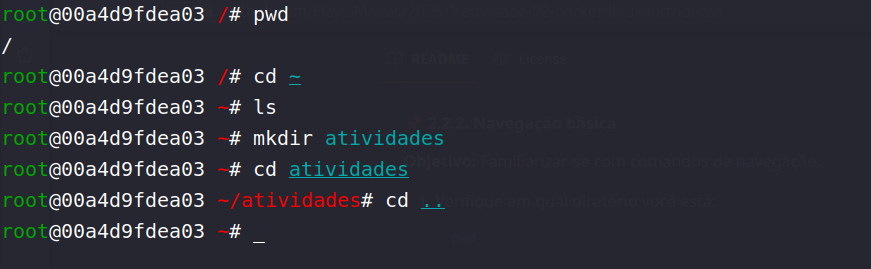
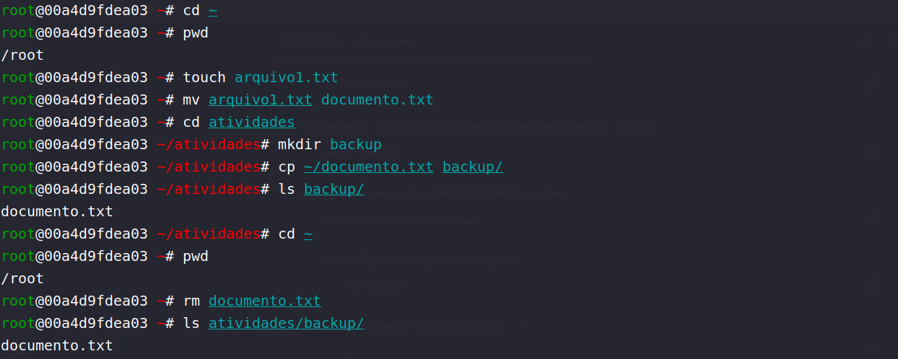
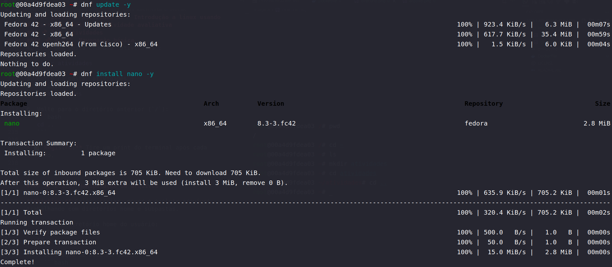
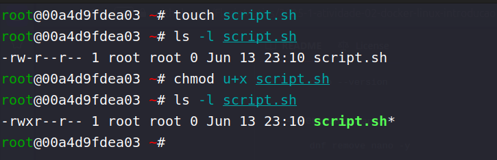
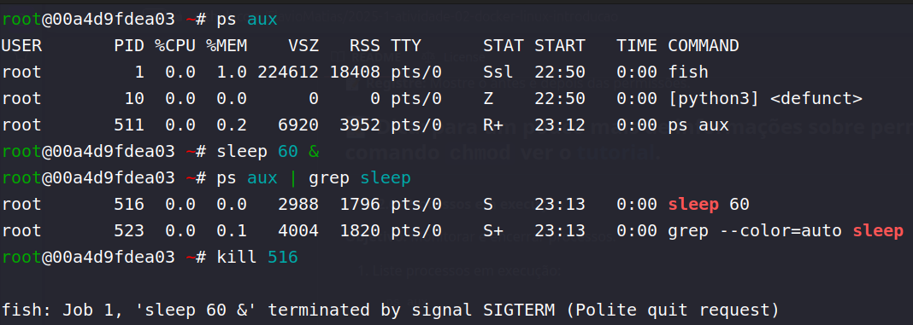

# Atividade 02 - Introdução ao Linux usando Docker no Windows  

**Aluno:** Flavio da Silva Matias  
**Data:** 13/jun/2025  

---

## Introdução

Esta atividade teve como objetivo introduzir os conceitos fundamentais do sistema operacional Linux por meio de um ambiente controlado via Docker, utilizando a imagem Fedora. As tarefas buscaram desenvolver familiaridade com comandos essenciais do terminal, manipulação de arquivos, permissões, processos e gerenciamento de pacotes.

---

## Relato das Atividades

### 🔹 2.2.1 - Navegação no sistema de arquivos

Comandos básicos como `pwd`, `cd`, `ls` e `mkdir` foram utilizados para explorar a estrutura de diretórios.

**Resultado da navegação**  

---

### 🔹 2.2.3 - Manipulação de arquivos

Execução de comandos para criação, renomeação, cópia e remoção de arquivos e diretórios.

**Criação e renomeação de arquivo**  

---

### 🔹 2.2.4 - Gerenciamento de pacotes

Instalação e remoção de pacotes utilizando o gerenciador `dnf`.

**Nano instalado com sucesso**  

**Nano removido com sucesso**  

---

### 🔹 2.2.5 - Permissões de arquivos

Alteração de permissões de execução utilizando o comando `chmod`.

**Permissões antes e depois do chmod**  

---

### 🔹 2.2.6 - Processos em execução

Listagem de processos ativos com `ps`, uso de `sleep` para simular processos, e finalização com `kill`.

**Processo em execução e encerrado**  

---

## Conclusão

Durante a atividade, aprendi a utilizar comandos fundamentais do terminal Linux em um ambiente isolado via Docker. Explorei a estrutura de diretórios, manipulei arquivos e permissões, instalei e removi pacotes, além de entender como monitorar e encerrar processos.  
A maior dificuldade foi compreender a lógica de permissões com `chmod`, mas a prática ajudou a fixar o entendimento.

